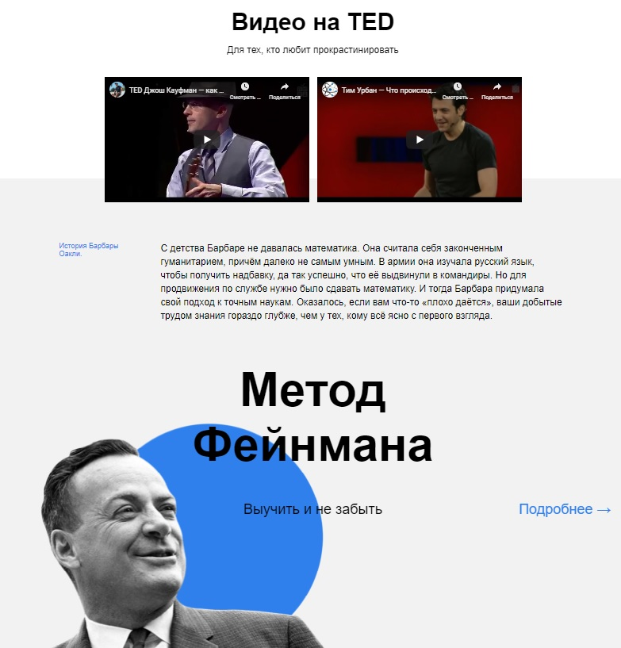
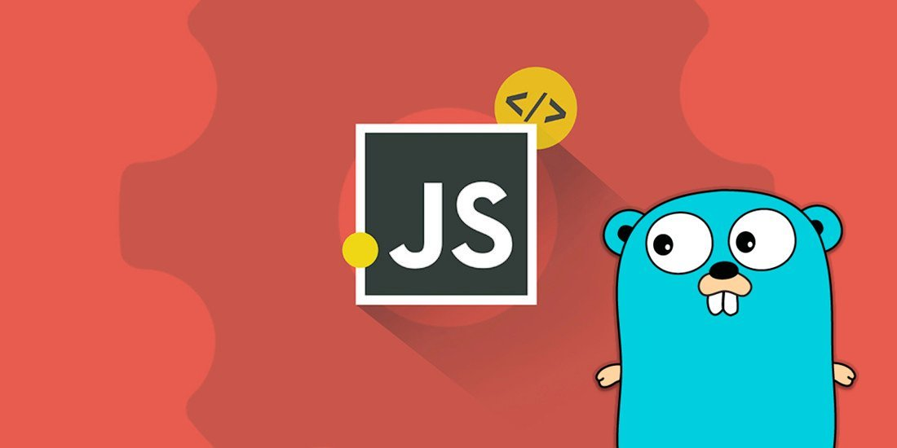

# Landing page "How to learn" (in progress)

The project talks about different effective approaches to learning. There is information about techniques, data, various ways of learning. Links and resources of great use can also be found there.

### Techniques used in the project:
* animation
* transformation
* flexbox
* iframe

### What`s next?

